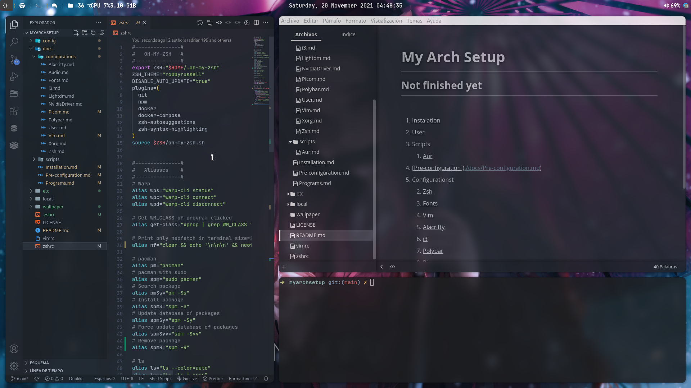
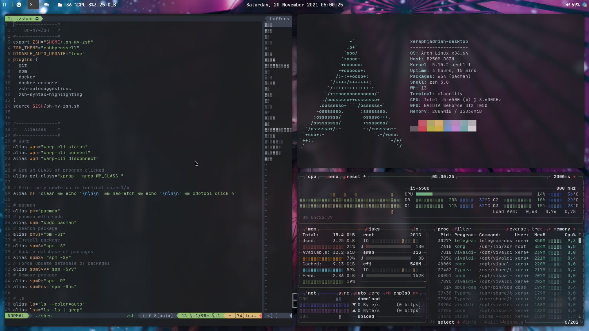

# My Arch Setup

### Not finished yet

1. [Installation](./docs/Installation.md)
2. [User](./docs/configurations/User.md)
3. Scripts
   1. [Aur](./docs/scripts/Aur.md)
4. [Pre-configuration](./docs/Pre-configuration.md)
5. Configurationst
   1. [Zsh](./docs/configurations/Zsh.md)
   2. [Fonts](./docs/configurations/Fonts.md)
   3. [Vim](./docs/configurations/Vim.md)
   4. [Alacritty](./docs/configurations/Alacritty.md)
   5. [i3](./docs/configurations/i3.md)
   6. [Polybar](./docs/configurations/Polybar.md)
   7. [Picom](./docs/configurations/Picom.md)
   8. [Xorg](./docs/configurations/Xorg.md)
   9. [NvidiaDriver](./docs/configurations/NvidiaDriver.md)
   10. [Audio](./docs/configurations/Audio.md)
   11. [Lightdm](./docs/configurations/Lightdm.md)
6. [Programs](./docs/Programs.md)

### Screenshots

